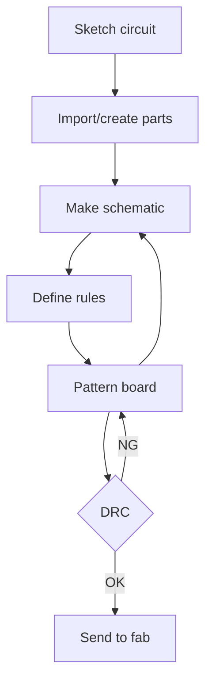
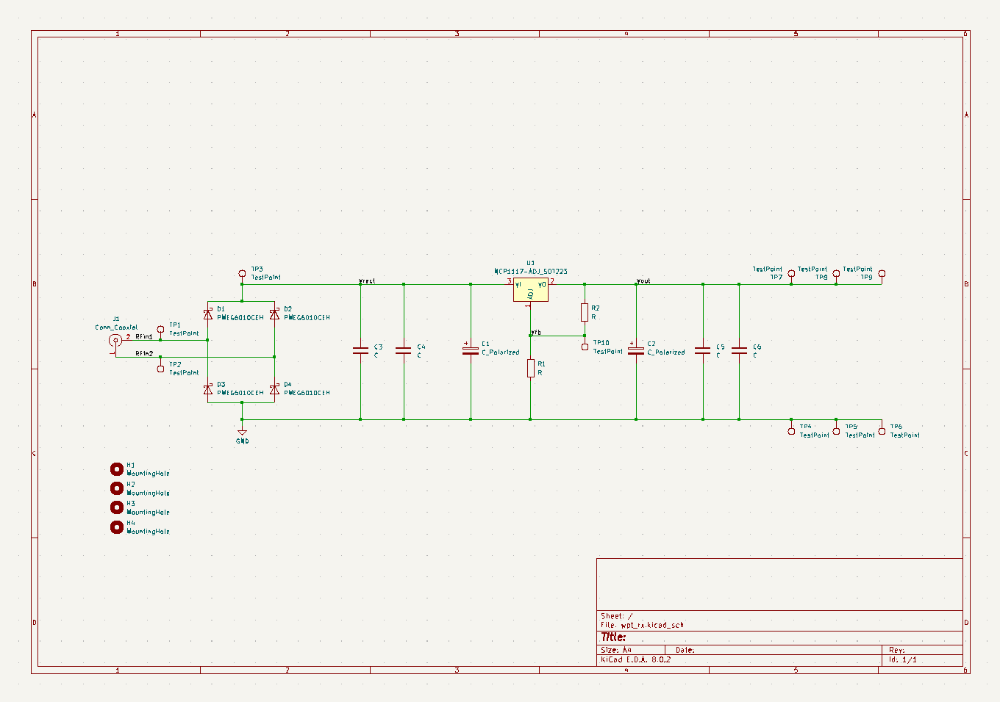
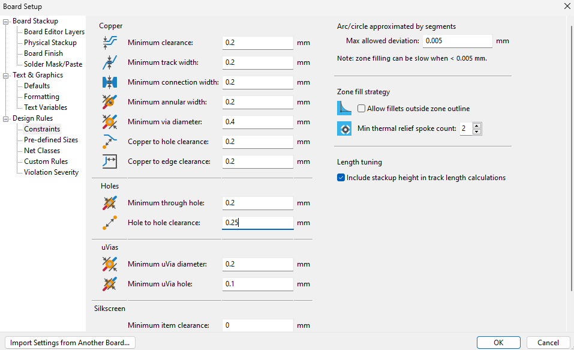
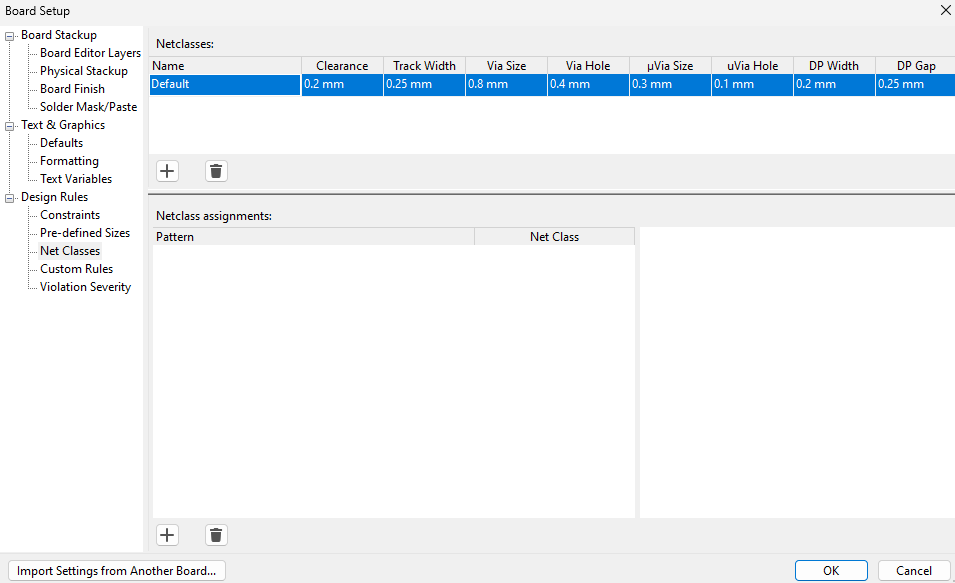
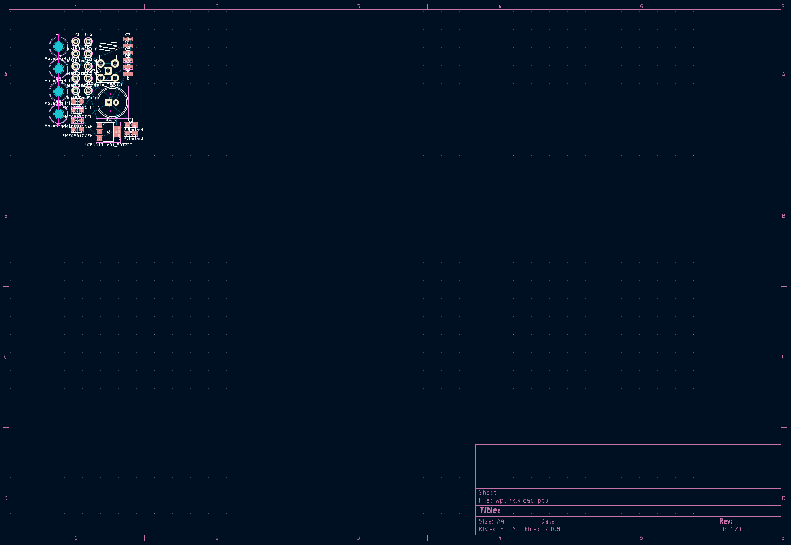
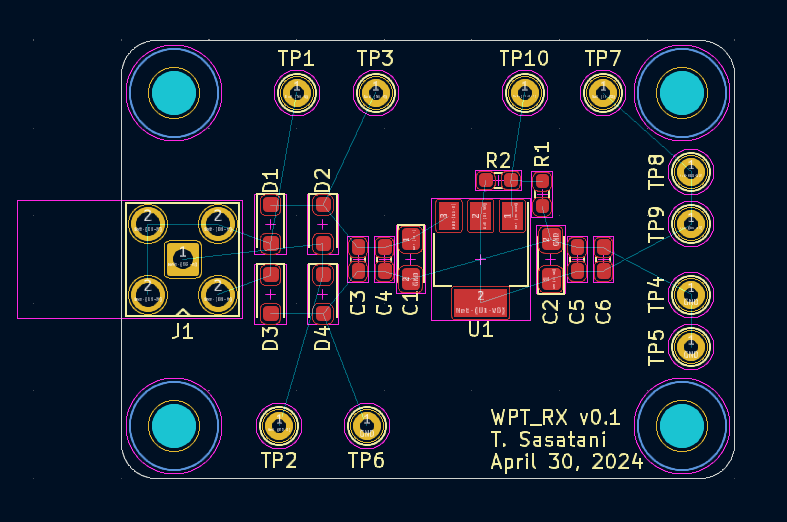
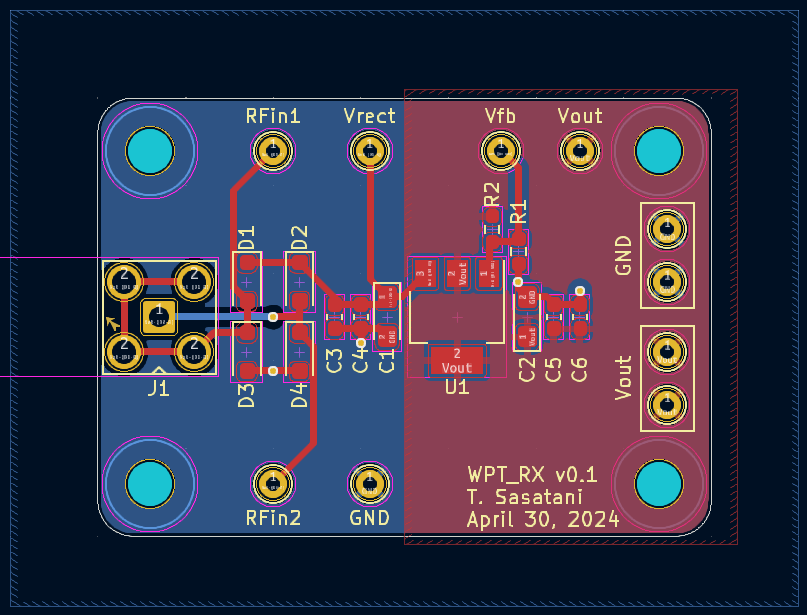
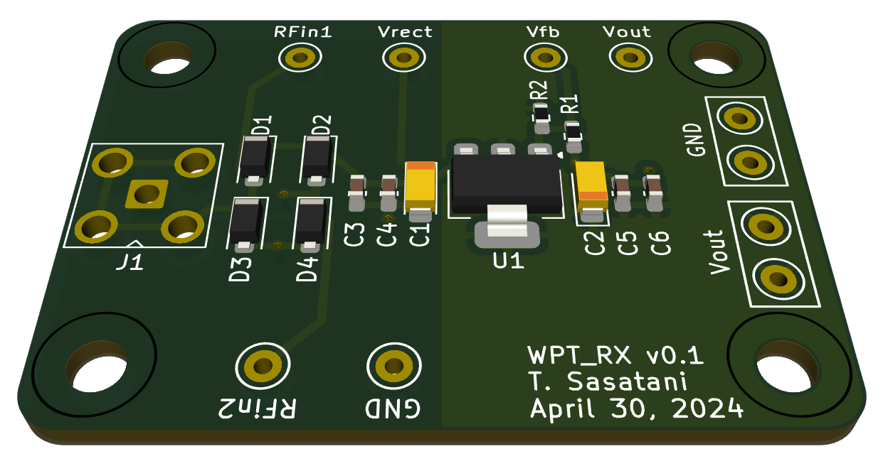

# KiCad tutorial

## Before beginning

### Download
- [KiCAD](https://www.kicad.org/): I'm using version 7.0, but 8.0 should be fine too.

### Tutorial video

## Hands on

### What you will learn
- The minimum workflow for using KiCad
- How to place orders to PCB manufactures
- Some elementary tips for prototyping circuits
- Files
    - [schematic](/KiCad/export/sch.pdf)
    - [board](/KiCad/export/brd.pdf)

### What you won't learn
- Circuit design (parts selection, patterning, etc.)

## 0. General workflow

### 1. Sketch circuit
- Roughly determine the core components you will use
    - Be careful of the availability of parts, etc
- For my case, I hand write a sketch
- We'll skip this in this tutorial

### 2. Import/create parts
- We will use components pre-loaded in KiCad, so we'll skip this part
- If you want to make parts, watch the following video.
    - TBD

### 3. Make schematic
#### Place the components

- **LDO: Voltage regulator (U1)**
    - Symbol: NCP1117-ADJ_SOT223
    - Footprint: Package_TO_SOT_SMD:SOT-223-3_TabPin2
    - [Digikey](https://www.digikey.jp/product-detail/ja/on-semiconductor/NCP1117STAT3G/NCP1117STAT3GOSCT-ND/1967218)

- **Ground: GND**
    - Symbol: GND

- **Tantalum Capacitors (C1, C2)**
    - Symbol: C_Polarized
    - Footprint: Capacitor_Tantalum_SMD:CP_EIA-3216-10_Kemet-I_Pad1.58x1.35mm_HandSolder
        - C1 = 10 uF, 25V, tant
        - C2 = 10 uF, 10V, tant
    - [Digikey-1](https://www.digikey.jp/ja/products/detail/kemet/T491A106M020AT/1739472)
    - [Digikey-2](https://www.digikey.jp/ja/products/detail/kemet/T491A106K010AT/818545)

- **Feedback resistor (R1, R2)**
    - Symbol: R
    - Footprint: Resistor_SMD:R_0603_1608Metric_Pad0.98x0.95mm_HandSolder
    - **Quiz: tune the output voltage to 9V, looking at the [LDO datasheet](https://www.onsemi.com/pdf/datasheet/ncp1117-d.pdf)**
        - R1 = ?
        - R2 = ?

- **Diode (D1, D2, D3, D4)**
    - Symbol: PMEG6010CEH
    - Footprint: Diode_SMD:D_SOD-123F
    - [Digikey](https://www.digikey.jp/product-detail/ja/nexperia-usa-inc/PMEG6010CEH-115/1727-3848-1-ND/1589917)

- **SMA connector (J1)**
    - Symbol: Conn_Coaxial
    - Footprint: Connector_Coaxial:SMA_Amphenol_901-143_Horizontal
    - [Digikey](https://www.digikey.jp/products/ja?keywords=60311002114501)

- **Ceramic capacitors: C_CHIP-0603(1608-METRIC) (C) (Version 4) (C3, C4, C5, C6)**
    - Symbol: C
    - Footprint: Capacitor_SMD:C_0603_1608Metric_Pad1.08x0.95mm_HandSolder
    - Values
        - C3 = 1000 pF
        - C4 = 0.1 uF
        - C5 = DNP
        - C6 = 0.1 uF

- **Jumper pin: PINHD-1X1 (JP1-JP8)**
    - Symbol: TestPoint
    - Footprint: TestPoint:TestPoint_Keystone_5000-5004_Miniature
    - Vout is also this pin.

- **Mounting hole (H1-H4)**
    - Symbol: MountingHole
    - MountingHole:MountingHole_3.2mm_M3

### Connect the components ("net" command)

- Name the wires
- "name" command
- This makes complex designs easier, so lets make it your habit.

## 4. Pattern board

### Constraints

### Board layout

### Check in 3-D CAD
- Look for mechanical intersections, etc.

## 5. Send to fab
- [PCBWay](https://www.pcbway.com/) and [Login information](https://sites.google.com/a/akg.t.u-tokyo.ac.jp/wiki) of lab account
- Use [PCBWay plug-in for KiCad](https://github.com/pcbway/PCBWay-Plug-in-for-Kicad)
- Try out gerber viewer (beta)
    - https://www.pcbway.com/project/OnlineGerberViewer.html

## Misc

### Links
- TBD
- https://componentsearchengine.com/